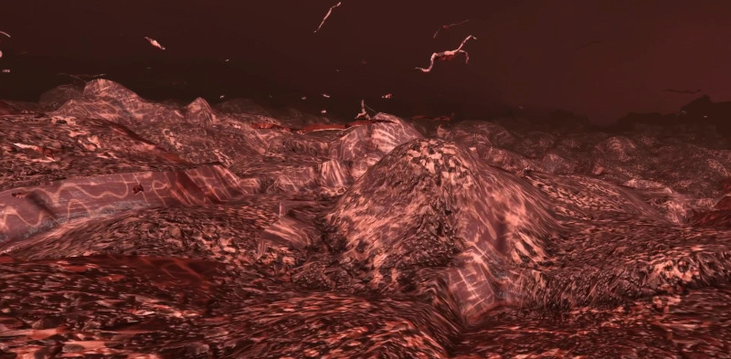

# Corpusim RDT Epithelial Tissue

updated 2022-03-11

This is a **Research, Discovery, and Testing** environment for procedural graphics - one of the core technologies used in Corpusim. Here we're focusing on implementing squamous epithelial tissues, essentially flaky, flat, barrier layers.

This project is written in [Godot](https://godotengine.org/) 3.4 and the [voxel-tools](https://github.com/Zylann/godot_voxel) plugin.

## Controls

<kbd>W</kbd><kbd>A</kbd><kbd>S</kbd><kbd>D</kbd> : Forward / Backward and Strafe

<kbd>Shift</kbd><kbd>Space</kbd> : Up / Down

Mouse Buttons : Add / Remove Voxels

### Using Virtual Reality Headset

Toggle the `VR Mode` check box in the `PlayerProbe` Scene

## Implementation

We're learning how to procedurally construct the requisite anatomical shapes using  SDF-based voxels.

Procedural textures are then applied using triplanar mapping and a fragment shader.

We are also using vertex shaders to animate the debris floating around - the dead, sloughed epithelial tissue.

## Godot voxel-tools plugin

We are making extensive use of the [voxel-tools plugin](https://github.com/Zylann/godot_voxel), written by Zylann.

This requires installing Godot from source, as Zylann [describes here](https://voxel-tools.readthedocs.io/en/latest/getting_the_module/).

If you want to contribute to the graphics work, I highly recommend reading the [documentation](https://voxel-tools.readthedocs.io/en/latest/overview/).